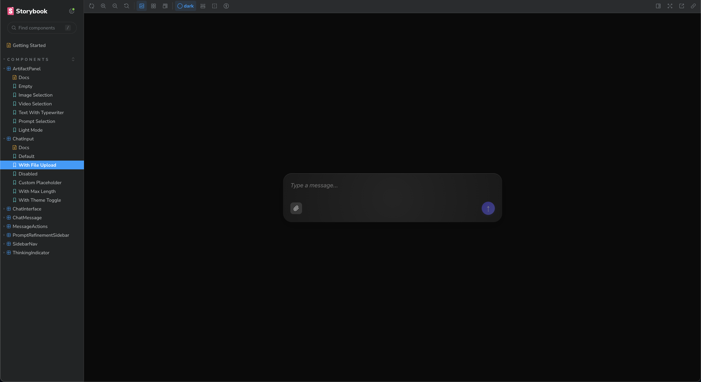

# Chat Component Library

Beautiful, accessible chat UI components for React applications with liquid glass aesthetics.



## Features

✨ **Modern Design** - Stunning liquid glass aesthetic with smooth animations  
🎨 **Themeable** - Built-in light and dark themes with custom theme support  
♿ **Accessible** - WCAG compliant with full keyboard navigation  
📱 **Responsive** - Works seamlessly across all device sizes  
⚡ **Performant** - Optimized for smooth interactions  
🔧 **TypeScript** - Full type safety and IntelliSense support  
📦 **Tree-shakeable** - Import only what you need

## Installation

```bash
npm install @pumpads/chat-component-library
```

```bash
yarn add @pumpads/chat-component-library
```

```bash
pnpm add @pumpads/chat-component-library
```

## Quick Start

```tsx
import { ChatInterface } from '@pumpads/chat-component-library'
import '@pumpads/chat-component-library/styles'

function App() {
  return (
    <ChatInterface
      messages={[
        { id: '1', role: 'user', content: 'Hello!' },
        { id: '2', role: 'assistant', content: 'Hi! How can I help you today?' }
      ]}
      onSendMessage={(message) => console.log(message)}
    />
  )
}
```

## Components

### ChatInterface
The main chat component that combines all other components into a complete chat experience.

```tsx
<ChatInterface
  messages={messages}
  onSendMessage={handleSend}
  isLoading={false}
  theme="dark"
/>
```

### ChatMessage
Display individual chat messages with markdown support and actions.

```tsx
<ChatMessage
  message={{
    id: '1',
    role: 'assistant',
    content: 'Hello! How can I help you?',
    timestamp: new Date()
  }}
  onCopy={() => {}}
  onRegenerate={() => {}}
/>
```

### ChatInput
A rich text input component for composing messages.

```tsx
<ChatInput
  onSend={(message) => console.log(message)}
  placeholder="Type your message..."
  disabled={false}
/>
```

### ThinkingIndicator
Animated indicator to show when the AI is processing.

```tsx
<ThinkingIndicator />
```

### MessageActions
Action buttons for messages (copy, regenerate, etc.).

```tsx
<MessageActions
  onCopy={() => {}}
  onRegenerate={() => {}}
  onEdit={() => {}}
/>
```

### ArtifactPanel
Display generated images, videos, or other media content.

```tsx
<ArtifactPanel
  type="image"
  imageOptions={[
    { url: '/image1.jpg', prompt: 'A sunset' },
    { url: '/image2.jpg', prompt: 'A forest' }
  ]}
  onSelect={(option) => console.log(option)}
/>
```

### PromptRefinementSidebar
Sidebar for refining and improving prompts with suggestions.

```tsx
<PromptRefinementSidebar
  isOpen={true}
  onClose={() => {}}
  suggestions={[
    { id: '1', text: 'Make it more detailed', category: 'detail' },
    { id: '2', text: 'Add context', category: 'context' }
  ]}
  onSelectSuggestion={(suggestion) => console.log(suggestion)}
/>
```

## Hooks

### useChatMessages
Manage chat messages state with built-in utilities.

```tsx
const {
  messages,
  addMessage,
  updateMessage,
  deleteMessage,
  clearMessages
} = useChatMessages()
```

### useTheme
Handle theme switching and persistence.

```tsx
const { theme, setTheme, toggleTheme } = useTheme()
```

## Theming

The library includes built-in light and dark themes. You can also create custom themes:

```css
:root {
  --chat-primary: #your-color;
  --chat-background: #your-bg;
  --chat-text: #your-text;
  /* ... more variables */
}
```

## Styling

Import the base styles in your app:

```tsx
import '@pumpads/chat-component-library/styles'
```

All components use CSS modules for scoped styling and can be customized via CSS variables.

## Development

```bash
# Install dependencies
npm install

# Start Storybook
npm run dev

# Build library
npm run build

# Type check
npm run type-check

# Lint
npm run lint
```

## Storybook

View all components in Storybook:

```bash
npm run dev
```

Then open http://localhost:6006

## Browser Support

- Chrome (latest)
- Firefox (latest)
- Safari (latest)
- Edge (latest)

## License

MIT © PumpAds

## Contributing

Contributions are welcome! Please feel free to submit a Pull Request.
